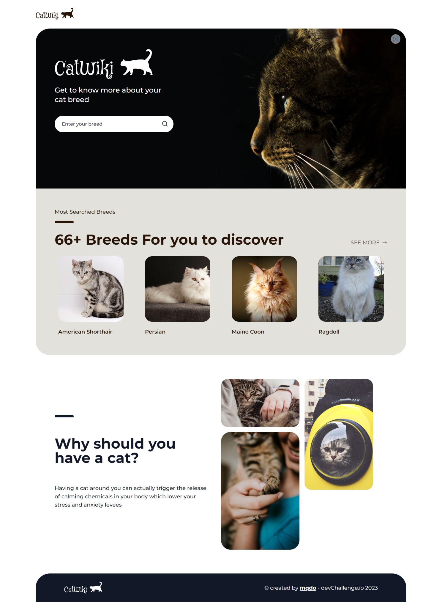

<!-- Please update value in the {}  -->

<h1 align="center">Cat Wiki</h1>

<div align="center">
   Solution for a challenge from  <a href="http://devchallenges.io" target="_blank">Devchallenges.io</a>.
</div>

<div align="center">
  <h3>
    <a href="https://mqdo-cat-wiki.netlify.app/">
      Demo
    </a>
    <span> | </span>
    <a href="https://github.com/mqdo/cat-wiki">
      Solution
    </a>
    <span> | </span>
    <a href="https://devchallenges.io/challenges/f4NJ53rcfgrP6sBMD2jt">
      Challenge
    </a>
  </h3>
</div>

<!-- TABLE OF CONTENTS -->

## Table of Contents

- [Overview](#overview)
  - [Built With](#built-with)
- [Features](#features)
- [How to use](#how-to-use)
- [Contact](#contact)
- [Acknowledgements](#acknowledgements)

<!-- OVERVIEW -->

## Overview



- You can see the demo at [Netlify](https://mqdo-cat-wiki.netlify.app/)
- What was your experience?
- This challenge was really fun, at first I thought it would be easy but when doing it some problems happened. Luckily in the end I managed to get over it and completed the challenge.
- In this challenge, I practiced handling data at server side and making more complex design in client side.

### Built With

- [React](https://reactjs.org/)
- [Tailwind](https://tailwindcss.com/)

## Features

This application/site was created as a submission to a [DevChallenges](https://devchallenges.io/challenges) challenge. The [challenge](https://devchallenges.io/challenges/f4NJ53rcfgrP6sBMD2jt) was to build an application to complete the given user stories.

## How To Use

To clone and run this application, you'll need [Git](https://git-scm.com) and [Node.js](https://nodejs.org/en/download/) (which comes with [npm](http://npmjs.com)) installed on your computer. From your command line:

```bash
# Clone this repository
$ git clone https://github.com/mqdo/cat-wiki

# Install dependencies
$ npm install

# Run the app
$ npm start
```

## Acknowledgements

- [Reactjs Popup](https://react-popup.elazizi.com/)
- [Node.js](https://nodejs.org/)
- [TheCatAPI](https://developers.thecatapi.com/)
- [React Icons](https://react-icons.github.io/react-icons/)

## Contact

- GitHub [@mqdo](https://github.com/mqdo/)
- Twitter [@mqdo_dev](https://twitter.com/mqdo_dev)
